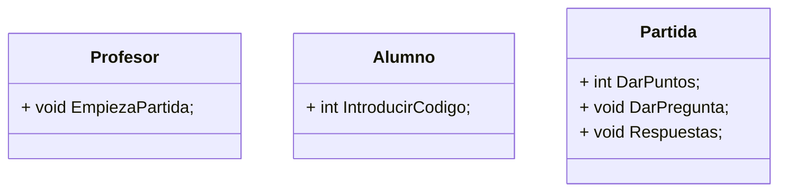

# Kahoot-UML
El UML de un Kahoot. (Funcionamiento de la Aplicación)

Tenemos 3 Clases:
- Profesor.
- Alumno.
- Partida.

Partiendo de esas 3 clases vamos a empezar la partida.

```mermaid
    classDiagram
      class Profesor{
      + void EmpiezaPartida;
    }
      class Alumno{
      + int IntroducirCodigo;  
    }
      class Partida{
      + int DarPuntos;
      + void DarPregunta;
      + void Respuestas;
    }
```
