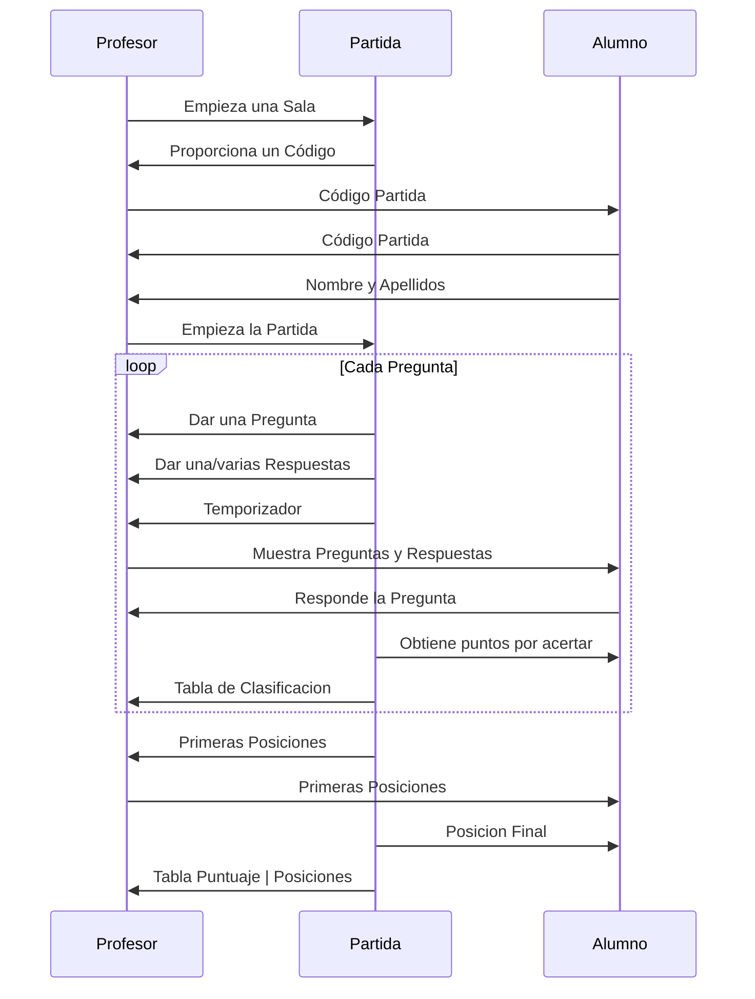
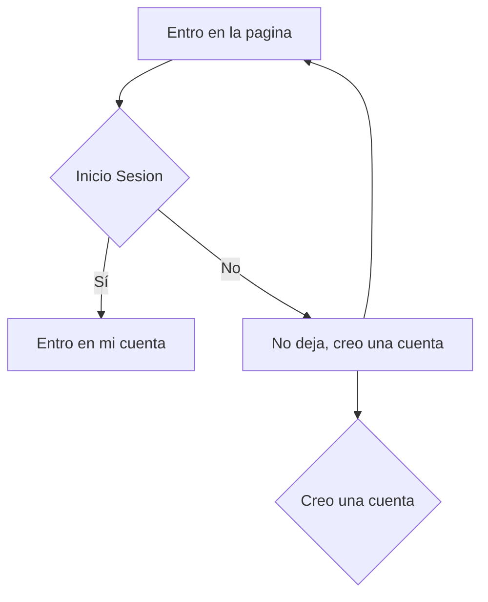

# Kahoot-UML
El UML de un Kahoot. (Funcionamiento de la Aplicación)

Tenemos 3 Clases:
- Profesor.
- Alumno.
- Partida.

Partiendo de esas 3 clases vamos a empezar la partida.

## Clase Profesor
Esta clase constituye todo lo que haga el profesor dentro de la partida, empezariamos con que nos proporcionaría el código para que los alumnos puedan entrar en la partida. 

Después mostraría las preguntas por pantalla y mostrando las preguntas, con un temporizador o dependiendo de las personas que contestes, finalmente la Partida le dará una lista con todo el puntuaje de todos los alumnos.

## Clase Alumno
Esta clase constituye todo lo que haga el alumno dentro de la partida, empezariamos metiendo el código para entrar en la Partida y introduciendo nuestro nombre para poder diferenciarnos, una vez dentro.

El Profesor muestra las preguntas y respuestas sugeridas por pantalla, entonces el Alumno escogerá la respuesta que más le convezca, todo con un temporizador, finalmente la Partida por cada pregunta le darás unos puntos si aciertan la pregunta y les dará sus respectivas posiciones.

## Clase Partida
Esta clase constituye todo lo que haga la Partida para proporcionar información tanto al Profesor como al Alumno, dependiendo de lo que haga cada uno.

La Partida le dará el código asignado al Profesor y recibirá los nombres de los alumnos,cuando empiece la partida, esta misma proporcionará al Profesor unas preguntas y unas respuestas para mostrar por pantalla, dependiendo si los Alumnos han acertado la pregunta o no, la Partida delegará ciertos puntos a cada alumno que haya acertado la pregunta.

(Más puntos si aciertas más rapido que los demás)

Finalmente, la Partida pasará un Excel al Profesor con una tabla de las posiciones y el puntuaje de los Alumnos para el Profesor.

UML de Actividades
